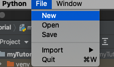

# wx: Menus & toolbars

### **Simple menu** 

若選單沒有正常顯示，將`wx.ID_EXIT`改成`APP_EXIT`，並在全域`APP_EXIT = 1`再執行一次試試

```python
Icons and shortcutfileItem = fileMenu.Append(wx.ID_EXIT, 'Quit', 'Quit application')
```

### APP\_EXSubmenus and separators

若選單沒有正常顯示，將`wx.ID_EXIT`改成`APP_EXIT`，並在全域`APP_EXIT = 1`再執行一次試試

```python
qmi = wx.MenuItem(fileMenu, wx.ID_EXIT, '&Quit\tCtrl+W')
```

畫出分隔線：

```python
fileMenu.AppendSeparator()
```




### Ref.








