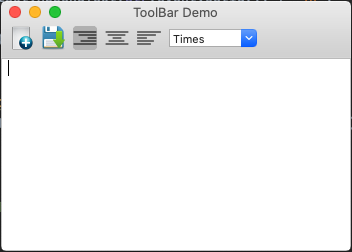

# wx: ToolBar

五個圖檔必須存在才能夠執行，置於專案目錄底下

```python
import wx


class Mywin(wx.Frame):

    def __init__(self, parent, title):
        super(Mywin, self).__init__(parent, title=title)
        self.InitUI()

    def InitUI(self):
        menubar = wx.MenuBar()
        menu = wx.Menu()
        menubar.Append(menu, "File")
        self.SetMenuBar(menubar)

        tb = wx.ToolBar(self, -1)
        self.ToolBar = tb

        tb.AddTool(101, "", wx.Bitmap("new.png"))
        tb.AddTool(102, "", wx.Bitmap("save.png"))

        right = tb.AddRadioTool(222, "", wx.Bitmap("right.png"))
        center = tb.AddRadioTool(333, "", wx.Bitmap("center.png"))
        justify = tb.AddRadioTool(444, "", wx.Bitmap("left.png"))

        tb.Bind(wx.EVT_TOOL, self.Onright)
        tb.Bind(wx.EVT_COMBOBOX, self.OnCombo)
        self.combo = wx.ComboBox(tb, 555, value="Times", choices=["Arial", "Times", "Courier"])

        tb.AddControl(self.combo)
        tb.Realize()
        self.SetSize((350, 250))

        self.text = wx.TextCtrl(self, -1, style=wx.EXPAND | wx.TE_MULTILINE)
        self.Centre()
        self.Show(True)

    def Onright(self, event):
        self.text.AppendText(str(event.GetId()) + "\n")
        obj = event.GetEventObject()
        print(obj.GetLabel())


    def OnCombo(self, event):
        self.text.AppendText(self.combo.GetValue() + "\n")


ex = wx.App()
Mywin(None, 'ToolBar Demo')
ex.MainLoop()
```



```python
tb.AddTool(101, "", wx.Bitmap("new.png"))
tb.AddTool(102, "", wx.Bitmap("save.png"))

# 此event binding對應到上面的AddTool()
tb.Bind(wx.EVT_TOOL, self.Onright)
```

```python
right = tb.AddRadioTool(222, "", wx.Bitmap("right.png"))
center = tb.AddRadioTool(333, "", wx.Bitmap("center.png"))
justify = tb.AddRadioTool(444, "", wx.Bitmap("left.png"))

# 此event binding對應到上面的AddRadioTool()
tb.Bind(wx.EVT_COMBOBOX, self.OnCombo)
```


## Ref.




